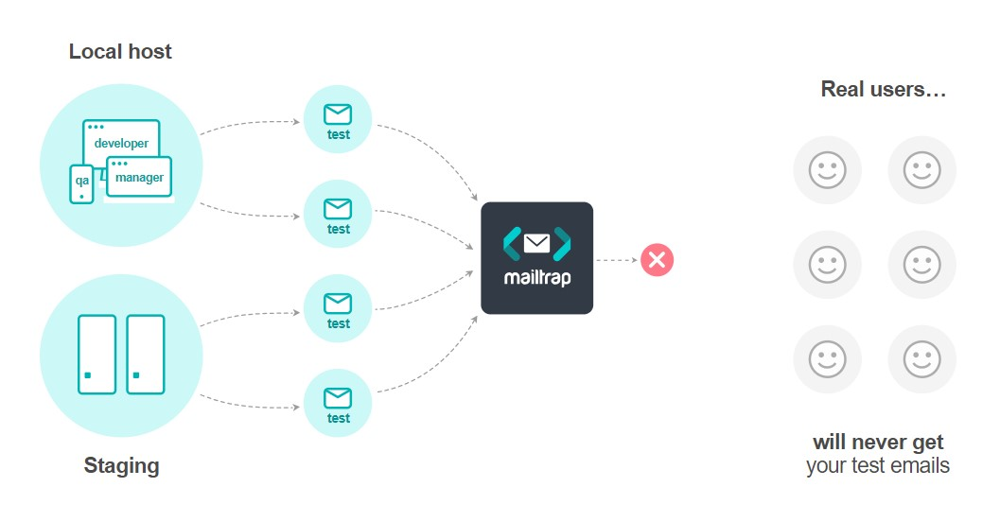
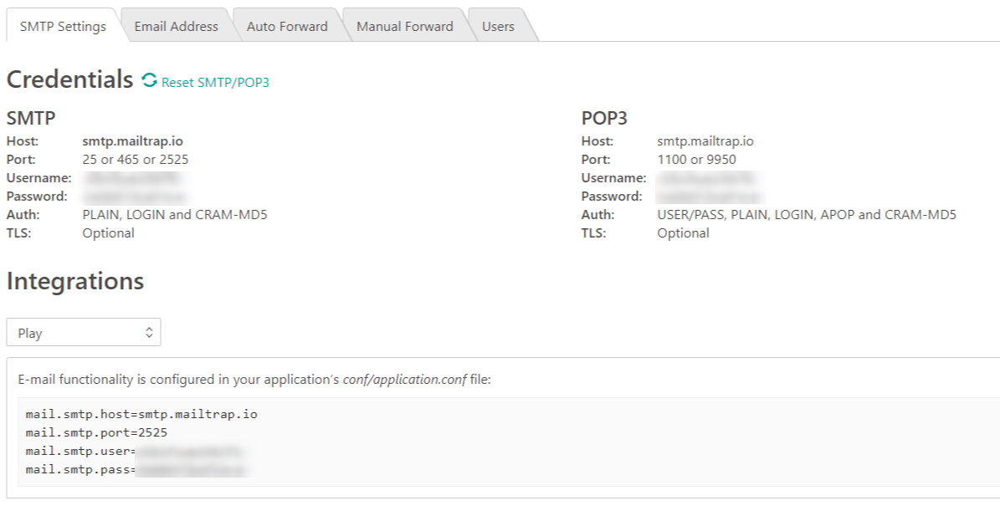

# Automatización de pruebas de EMAIL con MAILTRAP

En la mayoría de las aplicaciones que utilizamos a día de hoy, el uso del email contínua siendo una parte importante de muchas de las funcionalidades principales que éstos sistemas nos ofrecen. Ya sea para darnos de alta como usuarios, recuperar la contraseña, recibir informes, facturas, reservas de vuelos, alojamientos, etc. 
En defnitiva, el envío de correos electrónicos es algo que aún está muy ligado a la funcionalidad core de muchos sistemas.

Por otro lado, el mail, es algo que ya lleva mucho tiempo entre nosotros, lo consideremos un método de envío de información fiable y en prácticamente todos los lenguajes existen librerías que facilitan enormemente la tarea de composición y envío. Es por esto que en muchas ocasiones pasamos por alto las pruebas donde el envío de correos está implicado, ya sea por la complejidad de las mismas o porque damos por sentado que no habrá errores en esas partes.
No obstante existen determinados escenarios donde es aconsejable realizar unas pruebas mínimas, por ejemplo cuando queremos comprobar:

* Formato y diseño adecuados del cuerpo del correo
* Uso y sustitución correcta de campos de plantillas
* Ficheros adjuntados correctamente
* Envío correcto de links de activación de usuarios o reseteo de contraseñas
* Destinatarios y remitente generados correctamente

Los fallos en cualquiera de los elementos anteriormente citados pueden suponer errores de seguridad graves o un deterioro de la imagen de marca importante ante los clientes.

# Automatización de pruebas envío Email
## Mocking
A la hora de realizar pruebas unitarias de la funcionalidad en la que interviene el envío de emials, lo más habitual es la utilización de algún framework de mocking que simule dichas interacciones (mockito, Moq, sinon, etc.). Gracias a esto podremos comprobar que nuestro sistema cumple las especificaciones funcionales adecuadas y se comporta corretamente ante determinadas situaciones de error sin la necesidad de realizar envíos de correos reales.

## Pruebas de Integración o e2e
Aunque partamos de una buena base de pruebas unitarias, cuando abordemos la automatización de pruebas de integración, la gestión de los correos es un tema que no siempre es fácilmente automatizable ya que plantea varios puntos a tener en cuenta

* Qué cuentas van a recepcionar los emails
* Qué tipo de servidor recepciona los emails (IMAP, POP3, etc)
* Tengo acceso/credenciales para las cuentas que van a recepcionar los emails
* Cómo filtro los correos que me interesa controlar
* Control de flujo del envío o sincronía de la prueba

Esto son sólo unos ejemplos de las dificultades que plantea la automatización de pruebas cuando el email forma parte de la mismas. Como podría ser el caso de: alta de usuario, olvido de contraseña, envío de alertas, etc..

Para este tipo de situaciones Mailtrap puede resultar de gran utilidad

# MAILTRAP
## ¿Qué es?
Tal y como ellos mismos se definen se trata de un "*Fake SMTP testing server*". Es decir, propocionan un servicio en "la nube" que se comporta igual que un servidor SMTP real pero que no llega a enviar los emails a los destinatarios finales, en lugar de ello, los almacena para que se puedan realizar las verificaciones correspondientes. Tal y como se muestra en la figura:



 Para ello, en nuestro sistema, tendremos que indicar que se utilice mailtrap como servidor SMTP para el envío de correos. Estos datos de conexión podremos encontrarlos en nuestra cuenta de usuario. Incluso nos proporcionan el snippet adecuado para los lenguajes más comunes.

 

 Una vez que tenemos nuestro sistema configurado para que el envío de correos se realice mendiante mailtrap, ¿cómo podemos automatizar nuestras pruebas?. Es en este punto donde, mailtrap nos lo pone realmente fácil, ya que expone un **API** mediante la cual podremos acceder al buzón de correo adecuado para consultar y operar sobre los emails que se encuentran en el servidor.


## MailTrap API 
Toda la documentación referente al API de mailtrap puede consultarse [online](https://mailtrap.docs.apiary.io/). El hecho de que desde nuestras pruebas podamos hacer uso de un **API** para consultar el correo supone una gran ventaja por su sencillez, limpieza y la expresividad que aporta a los tests.
Gracias al API de mailtrap podremos leer los correos entrantes, eliminarlos, comprobar adjuntos, etc.

## Ejemplo

En este [enlace](https://github.com/morvader/MailTrap_Testing) puede ver un ejemplo de un programa que utiliza mailtrap para el envío de correos y los test correspondientes que verifican que efectivamente el mail se ha llegado a enviar.

### Envío de correo
En el servidor hay un método simple que envía correos

```
this.app.route('/').post(async (req, res) => {
            const message = Object.assign({}, req.body);
            Mail.from = message.from;
            Mail.to = message.to;
            Mail.subject = message.subject;
            Mail.message = message.message;
            const result = await Mail.sendMail();
            console.log(result);
            res.status(200).json({
                result,
            });
    });
```
A la hora de enviar el correo, la clase "*Mail.ts*", mediante la librería *nodemailer*, se encarga del envío del correo utilizando la configuración adecuada de mailtrap

```
const transporter = nodemailer.createTransport({
            host: config.host,
            port: config.port,
            secure: false,
            auth: {
                user: config.user,
                pass: config.password,
            },
            tls: { rejectUnauthorized: false },
        });

        console.log(mailOptions);

        await transporter.sendMail(mailOptions).then((info) => {
            console.log(info);
            result = 'Envio OK';
        }).catch((err) => {
            console.log(err);
            result = err.response;
        });
        return result;
```

### Test de integración
Una posible prueba automática para comprobar el correcto funcionamiento del envío de correos sería la siguiente:

Antes de cada pruebas borrar todos los correos del buzón:
```
 beforeEach((done) => {
    console.log('Clean Inbox');

    const cleanInbox = {
      url: mailtrapUrl + 'inboxes/' + inboxId + '/clean',
      headers: {
        'Api-Token': apiToken
      }
    };

    function callback(error, response, body) {
      console.log('Empty Inbox');
      expect(response.statusCode).toBe(200);
      done();
    }

    api.patch(cleanInbox, callback);
  });
```

La prueba se basa en el envío de un correo con un asunto específico (basado el timestamp) y la posterior comprobación de que efectivamente en mailtrap existe un correo con el mismo asunto.

```
 it('Send mail from app', (done) => {
    let timestamp = new Date();

    //Adjuntamos en TimeStamp en el asunto para tener controlado el email concreto 
    //sobre el que hacemos la pruebas
    let subjectText = "PruebaEnvio_" + timestamp.valueOf();
    let body = {
      from: 'TestMail@test.com',
      to: 'fran@test.com',
      subject: subjectText,
      message: 'Send Test'
    };

    //Pedimos a nuestro servidor que envie el correo
    request(app.app)
      .post('/')
      .send(body)
      .set('Accept', 'application/json')
      .expect('Content-Type', /json/)
      .expect(200) //Comprobamos que nuestro servidor responde correctamente
      .end(() => {
        console.log("Email sent");
        //Una vez finalizada la petición pasamos a comprobar en mailtrap que está el email enviado
        api.get(getEmailsEndPoint, checkMail);
      });

    const getEmailsEndPoint = {
      url: mailtrapUrl + 'inboxes/' + inboxId + '/messages',
      headers: {
        'Api-Token': apiToken
      },
    };

    let checkMail = function callback(error, response, body) {
      const info = JSON.parse(body);
      expect(response.statusCode).toBe(200);
      //Comprobamos que el asunto del correo coincide con el esperado
      expect(info[0].subject).toBe(subjectText);
      done();
    }
  });
```

### Instrucciones para arrancar el proyecto

Running the server:
* During development, we use both npm run watch-ts (recompiles application on source changes) and npm run watch-node (restarts application on recompilation)
  * One terminal: **npm run watch-ts**
  * Another terminal: **npm run watch-node**
* npm run build-ts only compiles the application
* npm run serve (npm run start) only starts the application
* npm run test run the tests: Send an email an verification

El ejemplo completo está disponible en [**GitHub**](https://github.com/morvader/MailTrap_Testing)